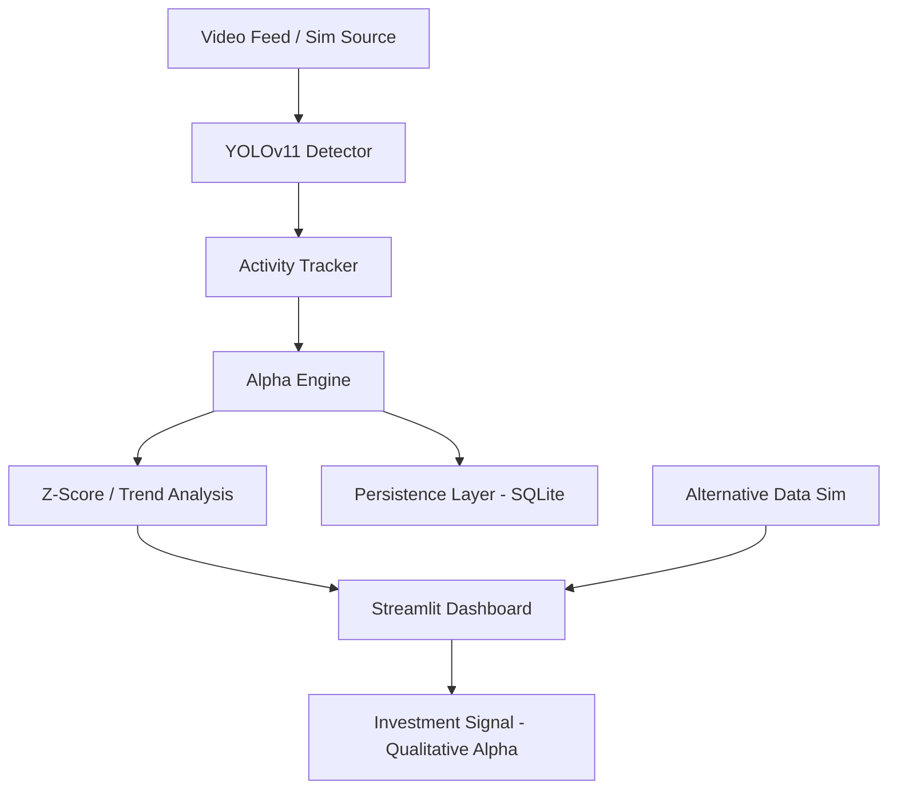

# 🛰️ Qualitative Alpha: Supply Chain Intelligence Suite (v2.0)

[](https://www.python.org/downloads/release/python-3110/)
[](https://docs.ultralytics.com/)
[](https://render.com)
[](https://opensource.org/licenses/MIT)

> **A Research Suite leveraging YOLOv11 Computer Vision to extract logistical telemetry, quantifying Qualitative Alpha through Statistical Anomaly Detection and Time-Series Forecasting for systematic investment research.**

---

## 📖 Overview

This platform provides **Qualitative Alpha**—non-traditional signals derived from real-world logistical activity. By using **YOLOv11** to monitor video feeds of ports, terminals, and highways, we transform visual pixels into high-frequency financial intelligence. 

The suite moves beyond simple counting, incorporating **Z-Score Anomaly Detection**, **Time-Series Forecasting**, and **Macro-Economic Correlation** to identify market-moving logistical shocks before they appear in traditional datasets.

---

## ✨ Key Features

### 🔍 Computer Vision Layer
- **YOLOv11 Detection**: High-speed, real-time detection of Trucks, Ships, Trains, and Cars.
- **Persistent Tracking**: Unique ID tracking to count logistical "velocity" rather than just static snapshots.

### 📉 Quantitative Alpha Engine
- **Statistical Anomaly Detection**: Real-time Z-Score calculation identifying events 3σ+ from the mean.
- **Trend Regression**: Significant expansion/contraction detection using linear regression p-values.
- **Holt-Winters Forecasting**: Time-series projection of terminal volume for T+1, T+2, and T+3 periods.

### 🔬 Research Lab
- **Macro Correlation**: Analyze how logistical activity correlates with Fuel Prices and Global Shipping Indices.
- **Statistical Distribution**: Visualizing frequency density and "fat-tail" logistical risks.
- **Persistence**: SQLite audit trail for historical backtesting and qualitative compliance.

---

## 🛠️ Technology Stack

| Category | Tools |
| :--- | :--- |
| **Core AI** | `ultralytics` (YOLOv11) |
| **Dashboard** | `Streamlit`, `Plotly` |
| **Analytics** | `Pandas`, `NumPy`, `SciPy`, `Statsmodels` |
| **Database** | `SQLite3` |
| **Deployment** | `Render Cloud`, `YAML Blueprints` |

---

## 🚀 Getting Started

### Quick Deployment
[](https://render.com/deploy?repo=https://github.com/ankushsingh003/Supply-Chain)

### Local Installation
1. **Clone the repository**:
   ```bash
   git clone https://github.com/ankushsingh003/Supply-Chain.git
   cd Supply-Chain
   ```
2. **Install dependencies**:
   ```bash
   pip install -r requirements.txt
   ```
3. **Launch the Dashboard**:
   ```bash
   streamlit run dashboard.py
   ```

---

## 🗺️ Project Architecture



---

## 📊 Visual Insights

### Live Telemetry


### Research Environment


---

## ⚖️ License
Distributed under the MIT License. See `LICENSE` for more information.

---

**Developed for IITM DoMS Research & Financial Engineering.**
